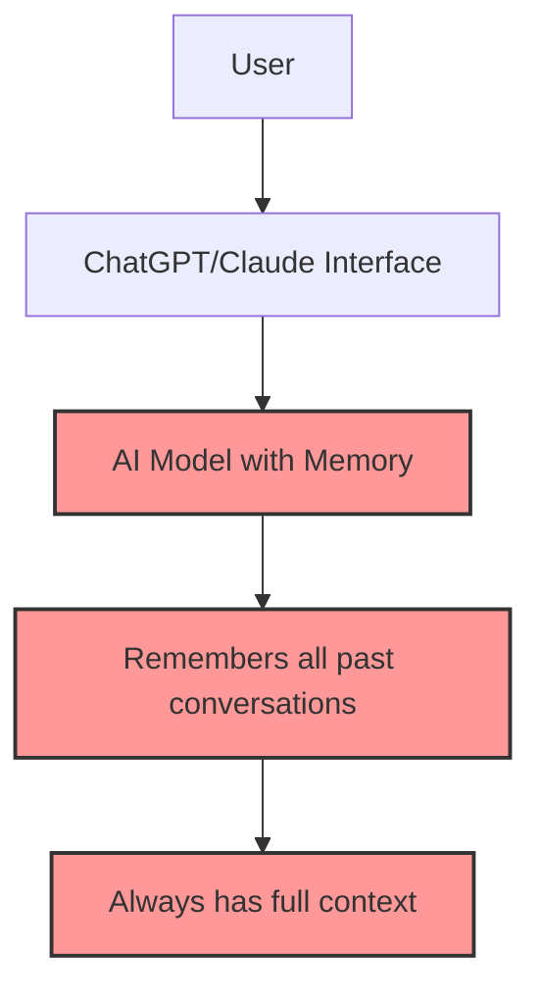
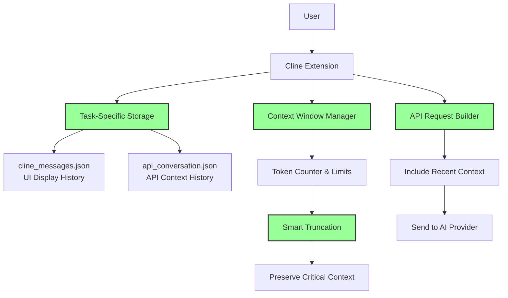

# How Cline Manages Conversation History

## Overview

Cline implements a sophisticated conversation history management system that handles multiple types of conversation data across different contexts. The system is designed to maintain context while preventing context window overflow, support task resumption, and provide efficient storage and retrieval.

## Common Misconceptions About LLM "Memory"

### Misconception 1: LLMs Have Persistent Memory Like Humans

**Popular Belief**: Many users think that when they chat with an AI like ChatGPT or Claude, the model "remembers" their conversation history across sessions, similar to how a human would remember a previous discussion.

**Reality**: Large Language Models are stateless. They don't have persistent memory between requests. Each API call is independent, and the model only "knows" what's included in the current context window.

### Misconception 2: Conversation History is Stored in the AI Model

**Popular Belief**: Users often assume that their chat history is stored within the AI service (OpenAI, Anthropic, etc.) and retrieved automatically in future conversations.

**Reality**: AI providers typically don't store personal conversation history for privacy and compliance reasons. The conversation context must be explicitly provided with each request.

### Misconception 3: All Previous Messages are Always Available

**Popular Belief**: Many expect that they can reference any part of their conversation history at any time, assuming the AI has access to everything they've ever discussed.

**Reality**: Due to context window limitations (typically 100K-200K tokens), only a portion of conversation history can be included in each request. Older parts are truncated or summarized.

## The Reality: How Cline Manages Conversation Memory

Cline implements a sophisticated system that simulates "memory" through careful state management, not through the LLM itself having persistent memory.

### Diagram 1: Common Misconception - "AI Has Built-in Memory"



### Diagram 2: Reality - Cline's Conversation Management System



## Architecture Components

### 1. Message Types

Cline manages two primary types of conversation messages:

**Cline Messages** (`clineMessages`)
- User-facing conversation history displayed in the chat interface
- Contains formatted messages with different content types (text, tool uses, tool results, errors)
- Stored in task-specific files for persistence
- Used for UI display and conversation context

**API Conversation History** (`apiConversationHistory`)
- Raw conversation data sent to AI providers
- Contains assistant and user messages in API format
- Includes tool use blocks and tool results
- Used for maintaining context in API requests

### 2. Storage System

- Windows: `~/AppData/Roaming/Code/User/globalStorage/saoudrizwan.claude-dev`
- WSL: `~/vscode-server/data/User/globalStorage/saoudrizwan.claude-dev`
- Linux: `~/.config/Code/User/globalStorage/saoudrizwan.claude-dev`

#### Task-Specific Storage
Each task maintains its own conversation history in dedicated files:
```
tasks/
├── task_123456/
│   ├── cline_messages.json    # UI-facing messages
│   └── api_conversation.json  # API conversation history
```

#### Message Structure
```typescript
// Cline Message Example
{
  "type": "text",
  "text": "User message content",
  "timestamp": "2024-01-01T00:00:00.000Z"
}

// API Conversation Message Example
{
  "role": "user",
  "content": [
    {
      "type": "text",
      "text": "API message content"
    }
  ]
}
```

## Context Management System

### Context Window Monitoring

Cline actively monitors token usage to prevent context window overflow:

```typescript
// Token tracking in API requests
const { tokensIn, tokensOut } = JSON.parse(previousRequest?.text || "{}")
const totalTokens = (tokensIn || 0) + (tokensOut || 0)

// Context limit checking
if (totalTokens >= maxAllowedSize) {
  // Trigger conversation truncation
}
```

### Intelligent Truncation

When approaching context limits, Cline implements smart truncation strategies:

**Truncation Ranges**
- **Half truncation**: Removes 50% of conversation when moderately pressured
- **Quarter truncation**: Removes 75% when severely pressured
- **Preserves critical context**: Always maintains original task message and recent exchanges

**Model-Specific Limits**
- **DeepSeek**: 64K context window
- **Most models**: 128K context window
- **Claude**: 200K context window
- **Buffer zones**: 27K-40K token buffers depending on model

### Truncation Process

```typescript
// ContextManager truncation logic
getNextTruncationRange(
  apiConversationHistory,
  conversationHistoryDeletedRange,
  strategy: "half" | "quarter"
): TruncationRange
```

The system:
1. Identifies safe truncation points
2. Preserves conversation structure
3. Maintains user-assistant turn-taking
4. Updates deletion range tracking

## Task State & Resumption

### Task Persistence

Each task maintains comprehensive state for resumption:

```typescript
interface TaskState {
  taskId: string
  clineMessages: ClineMessage[]
  apiConversationHistory: ApiMessage[]
  currentStreamingContentIndex: number
  conversationHistoryDeletedRange?: TruncationRange
  // ... other state
}
```

### Resumption Process

When resuming an interrupted task:

1. **Load saved state** from task-specific files
2. **Handle interrupted tools** by marking incomplete tool calls
3. **Reconstruct context** with resumption notification
4. **Continue execution** from the interruption point

```typescript
// Resumption notification
newUserContent.push({
  type: "text",
  text: `[TASK RESUMPTION] This task was interrupted ${agoText}. It may or may not be complete, so please reassess the task context.`
})
```

## Message Streaming System

### Real-Time Updates

Cline implements a sophisticated streaming system for real-time conversation updates:

**Streaming Locks**
- Prevents race conditions during message presentation
- Handles concurrent updates safely
- Queues pending updates when locked

**Content Block Processing**
```typescript
// Message presentation flow
while (streaming) {
  const block = assistantMessageContent[currentIndex]

  switch (block.type) {
    case "text":
      await presentTextBlock(block)
      break
    case "tool_use":
      await presentToolBlock(block)
      break
  }

  if (!block.partial) {
    currentIndex++
  }
}
```

### Partial Content Handling

- Supports incremental message updates
- Handles streaming tokens as they arrive
- Maintains message state during partial updates
- Provides smooth user experience with real-time feedback

## Error Recovery & State Management

### Error Handling in Conversations

When errors occur during conversation processing:

1. **Error presentation** to user with detailed context
2. **State cleanup** of failed operations
3. **Recovery options** for retry attempts
4. **Context preservation** for debugging

### Checkpoint Integration

Conversation history integrates with Cline's checkpoint system:

- **Automatic checkpoints** after significant operations
- **Git-based storage** for reliable persistence
- **State restoration** from any checkpoint
- **Change tracking** across conversation history

## Performance Optimizations

### Memory Management

- **Lazy loading** of conversation history
- **Incremental updates** instead of full refreshes
- **Efficient serialization** for storage
- **Garbage collection** of old conversation data

### Caching Strategies

- **Message caching** for frequently accessed conversations
- **Token counting optimization** to avoid recalculation
- **Context window pre-allocation** for better performance

## Integration with Other Systems

### Webview Synchronization

Conversation history synchronizes between:
- **Core extension** (backend state management)
- **Webview UI** (React components)
- **VSCode global state** (persistent storage)
- **Task-specific files** (per-task persistence)

### API Provider Integration

Different API providers have varying context window sizes and requirements:
- **Context size adaptation** based on provider capabilities
- **Provider-specific truncation** strategies
- **Token counting** variations by provider
- **Error handling** for provider-specific issues

## Best Practices

### Conversation Management

1. **Monitor context usage** regularly
2. **Implement proactive truncation** before hitting limits
3. **Preserve critical context** during truncation
4. **Handle interruptions** gracefully with clear notifications
5. **Maintain conversation structure** during all operations

### Performance Considerations

1. **Batch updates** when possible
2. **Use efficient serialization** formats
3. **Implement proper indexing** for large conversations
4. **Clean up old data** regularly
5. **Monitor memory usage** during long conversations

## Future Enhancements

Potential improvements to conversation history management:

1. **Advanced summarization** for long conversations
2. **Semantic search** through conversation history
3. **Conversation branching** for exploring alternatives
4. **Export/import** capabilities for conversation data
5. **Advanced analytics** on conversation patterns

---

*This documentation covers Cline's comprehensive conversation history management system, including storage, context management, task resumption, streaming, and integration with other Cline systems.*
