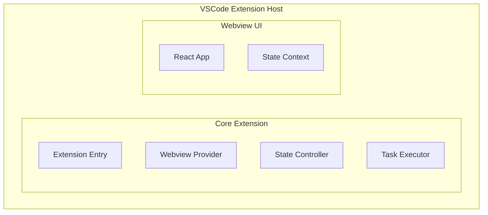

# <!--fit--> Cline: AI Assistant for VSCode

## A Deep Dive into Core Features

---

# <!--fit--> What is Cline?

**Cline is a powerful VSCode extension** that brings AI assistance directly into your development environment

- **Autonomous coding agent** that can write, edit, and debug code
- **Multi-model support** with providers like Anthropic, OpenRouter, AWS Bedrock
- **Tool-based architecture** for real-world development tasks
- **Seamless integration** with your existing workflow

---

# <!--fit--> Core Architecture

## Modular Design for Maximum Flexibility

---

# <!--fit--> Key Features Overview

1. Multi-Provider AI Support
2. Advanced Tool System
3. Plan/Act Mode System
4. MCP Integration
5. Robust State Management
6. Checkpoint System

---

# <!--fit--> Multi-Provider AI Support

### Connect with Your Preferred AI Services

- **Anthropic Claude** - Direct integration with Claude models
- **OpenRouter** - Access to multiple model providers
- **AWS Bedrock** - Enterprise-grade AI services
- **Google Gemini** - Google's AI models
- **Local Models** - Ollama, LM Studio support
- **VSCode Language Models** - Built-in VSCode AI

---

# <!--fit--> Advanced Tool System

### Real-World Development Capabilities

**File Operations**
- `read_file`, `write_to_file`, `replace_in_file`
- `list_files`, `search_files`

**Development Tools**
- `execute_command` - Terminal operations
- `attempt_completion` - Task finalization
- `ask_followup_question` - User interaction

**Browser Automation**
- Puppeteer-based web interaction
- Screenshot capture and analysis

---

# <!--fit--> Plan/Act Mode System

### Separate Planning from Execution

**Plan Mode** 🧭
- Information gathering and context building
- Ask clarifying questions
- Create detailed execution plans
- Discuss approaches with user

**Act Mode** ⚡
- Execute the planned actions
- Use tools to modify files, run commands
- Implement solutions
- Provide results and completion

---

# <!--fit--> MCP Integration

### Model Context Protocol Support

**What is MCP?**
- Open protocol for AI model context sharing
- Connect external tools and resources
- Standardized communication interface

**Cline MCP Features**
- Built-in MCP Hub for server management
- Auto-discovery of MCP servers
- Tool and resource integration
- Marketplace for MCP servers

---

# <!--fit--> Robust State Management

### Persistent and Consistent Experience

**Multi-Level Storage**
- **Global State** - Cross-instance settings
- **Workspace State** - Project-specific data
- **Secrets Storage** - Secure API key management

**Real-time Synchronization**
- State consistency across webview reloads
- Multi-instance coordination
- Automatic state recovery

---

# <!--fit--> Checkpoint System

### Git-Based Project Safety Net

**Automatic Checkpoints**
- Created after each tool execution
- Track file changes automatically
- Enable rollback to any state

**Recovery Features**
- Task resumption from interruption
- File change comparison
- State restoration capabilities

---

# <!--fit--> Context Management

### Intelligent Conversation Handling

**Dynamic Context Window**
- Model-aware sizing (64K-200K tokens)
- Proactive truncation strategies
- Preserve critical context

**Smart Preservation**
- Always maintain original task message
- User-assistant conversation structure
- Adaptive truncation based on pressure

---

# <!--fit--> Developer Experience

### Built for Developers, by Developers

**IDE Integration**
- Native VSCode webview interface
- Sidebar and tab panel support
- Hot Module Replacement for development

**Customization**
- Cline Rules for project-specific guidelines
- Hooks for workflow automation
- Extensible architecture

---

# <!--fit--> Security & Privacy

### Enterprise-Ready Security

**Data Protection**
- Local-first approach
- Secure API key storage
- Workspace isolation

**Control**
- `.clineignore` for file access control
- Hook-based validation system
- Audit trail through checkpoints

---

# <!--fit--> Getting Started

### Quick Setup Guide

1. **Install Cline** from VSCode Marketplace
2. **Configure API provider** (Anthropic, OpenRouter, etc.)
3. **Set up Cline Rules** (optional but recommended)
4. **Start your first task** with `Cmd+Shift+P` → "Cline: New Task"

---

# <!--fit--> Thank You!

## Questions?

**Explore More:**
- GitHub: `cline/cline`
- Documentation: Built-in VSCode extension
- Community: Discord and GitHub Discussions

**Start building with AI today!** 🚀
